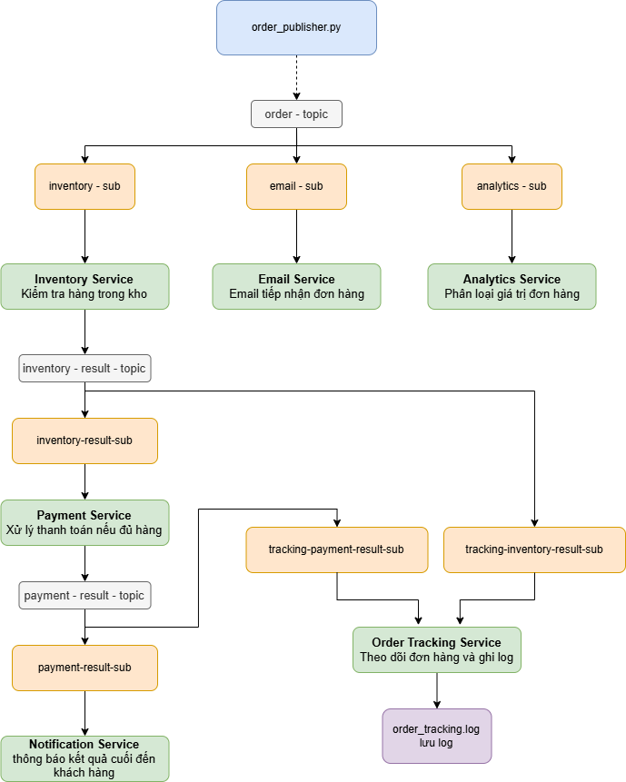

# Hệ thống xử lý đơn hàng phân tán sử dụng Google Cloud Pub/Sub

## 1. Giới thiệu dự án

Dự án mô phỏng hệ thống xử lý đơn hàng trong thương mại điện tử theo mô hình hệ phân tán.
Các thành phần trong hệ thống như đặt hàng, kiểm tra kho, xử lý thanh toán, gửi thông báo và theo dõi đơn hàng được tách thành các service độc lập.

Các service giao tiếp với nhau thông qua Google Cloud Pub/Sub, giúp hệ thống xử lý bất đồng bộ, giảm sự phụ thuộc trực tiếp giữa các thành phần và dễ mở rộng.

## 2. Công nghệ sử dụng

- Python
- Google Cloud Pub/Sub
- Google Cloud Shell
- GitHub
- JSON message

## 3. Kiến trúc hệ thống



Hệ thống gồm một publisher và nhiều subscriber. 
`order_publisher.py` tạo đơn hàng và gửi message vào `order-topic`. 
Các subscriber sẽ nhận message, xử lý theo từng nhiệm vụ riêng và publish kết quả sang các topic tiếp theo.

## 4. Danh sách topic và subscription

| Topic | Subscription | Service sử dụng | Vai trò |
|---|---|---|---|
| order-topic | inventory-sub | inventory_subscriber.py | Nhận đơn hàng để kiểm tra tồn kho |
| order-topic | email-sub | email_subscriber.py | Nhận đơn hàng để gửi thông báo tiếp nhận |
| order-topic | analytics-sub | analytics_subscriber.py | Nhận đơn hàng để phân tích/thống kê |
| inventory-result-topic | inventory-result-sub | payment_subscriber.py | Nhận kết quả kiểm kho để xử lý thanh toán |
| inventory-result-topic | tracking-inventory-result-sub | order_tracking_subscriber.py | Theo dõi kết quả kiểm kho |
| payment-result-topic | payment-result-sub | payment_notification_subscriber.py | Nhận kết quả thanh toán để gửi thông báo |
| payment-result-topic | tracking-payment-result-sub | order_tracking_subscriber.py | Theo dõi kết quả thanh toán |

## 5. Chức năng chính

- Tạo đơn hàng mới và gửi thông tin đơn hàng lên Google Cloud Pub/Sub.
- Tách hệ thống thành nhiều service độc lập như Inventory Service, Payment Service, Email Service, Analytics Service và Order Tracking Service.
- Các service giao tiếp bất đồng bộ thông qua topic và subscription.
- Xử lý đơn hàng theo từng bước: tiếp nhận đơn hàng, kiểm tra kho, thanh toán, thông báo và ghi nhận trạng thái.
- Hỗ trợ theo dõi kết quả xử lý thông qua terminal và file log.

## 6. Chức năng mới phát triển

### 6.1. Kiểm tra tồn kho trước khi thanh toán

Hệ thống bổ sung Inventory Service để kiểm tra số lượng hàng trong kho trước khi chuyển đơn hàng sang bước thanh toán. 
Nếu hàng trong kho đủ, service sẽ gửi kết quả thành công sang `inventory-result-topic`. 
Nếu không đủ hàng, hệ thống không tiếp tục xử lý thanh toán.

Chức năng này giúp tránh tình trạng khách hàng thanh toán thành công nhưng sản phẩm không còn trong kho.

### 6.2. Gửi thông báo sau khi xử lý thanh toán

Sau khi Payment Service xử lý thanh toán, kết quả được gửi sang `payment-result-topic`. 
Payment Notification Service sẽ nhận kết quả này và hiển thị thông báo thanh toán thành công hoặc thất bại cho khách hàng.

### 6.3. Theo dõi đơn hàng và ghi log

Order Tracking Service lắng nghe kết quả từ cả `inventory-result-topic` và `payment-result-topic`. 
Các trạng thái xử lý đơn hàng được ghi vào file `logs/order_tracking.log`, giúp theo dõi lịch sử xử lý và hỗ trợ kiểm tra lỗi khi vận hành.

## 7. Cách chạy demo trên Google Cloud Shell

Dự án được chạy demo trên Google Cloud Shell và sử dụng Google Cloud Pub/Sub. Vì vậy cần có quyền truy cập vào Google Cloud Project đã tạo các topic và subscription.

Vui lòng liên hệ với thành viên nhóm qua email để được cấp quyền.
Email liên hệ: nguyenquynhtrang7092005@gmail.com

Hoặc tự tạo project mới trên Google Cloud và tạo lại các topic/subscription theo cấu hình trong config.py.
### Chọn đúng Google Cloud Project

 Thực hiện các lệnh sau để xem demo:

```bash
gcloud projects list #kiểm tra danh sách project
gcloud config set project <PROJECT_ID> #project dùng để demo
gcloud config get-value project #kiểm tra project hiện tại
git clone <GITHUB_REPOSITORY_URL> #clone mã nguồn từ gitHub
cd BTL_Ung_dung_phan_tan
pip install -r requirements.txt #cài đặt thư viện
gcloud pubsub topics list #kiểm tra các topic
gcloud pubsub subscriptions list #kiểm tra subscription
# Mở nhiều terminal trong gg cloud shell để Chạy các subscriber, mỗi terminal chạy 1 subscriber

python subscribers/inventory_subscriber.py
python subscribers/payment_subscriber.py
python subscribers/payment_notification_subscriber.py
python subscribers/order_tracking_subscriber.py
python subscribers/email_subscriber.py
python subscribers/analytics_subscriber.py

#mở terminal mới chạy publisher
python publisher/order_publisher.py

```

Sau khi chạy publisher, đơn hàng sẽ được gửi lên order-topic và các subscriber sẽ xử lý theo từng chức năng.

## 8. Kết quả mong đợi

Khi chạy chương trình, hệ thống sẽ:

1. Tạo đơn hàng mới.
2. Gửi đơn hàng lên `order-topic`.
3. Inventory Service kiểm tra tồn kho,Email Service gửi email tiếp nhận đơn hàng, Analytics Service phân loại giá trị đơn hàng .
4. Nếu đủ hàng, Payment Service xử lý thanh toán.
5. Payment Notification Service gửi thông báo kết quả thanh toán.
6. Order Tracking Service ghi trạng thái xử lý vào file log.

## 9. Cấu trúc thư mục

```text
BTL_Ung_dung_phan_tan/
│
├── publisher/
│   └── order_publisher.py
│
├── subscribers/
│   ├── analytics_subscriber.py
│   ├── email_subscriber.py
│   ├── inventory_subscriber.py
│   ├── order_tracking_subscriber.py
│   ├── payment_notification_subscriber.py
│   └── payment_subscriber.py
│
├── docs/
│   |── architecture.md
│   |── Bcao_ung_dung_phan_tan.pdf
│   └── Kien_truc_dat_hang_final.drawio.png
|
│
├── logs/
│   └── order_tracking.log
│
├── config.py
├── requirements.txt
├── README.md
└── .gitignore
```
Lưu ý : File log sẽ tự động được tạo khi chạy file `order_tracking_subscriber.py`.
